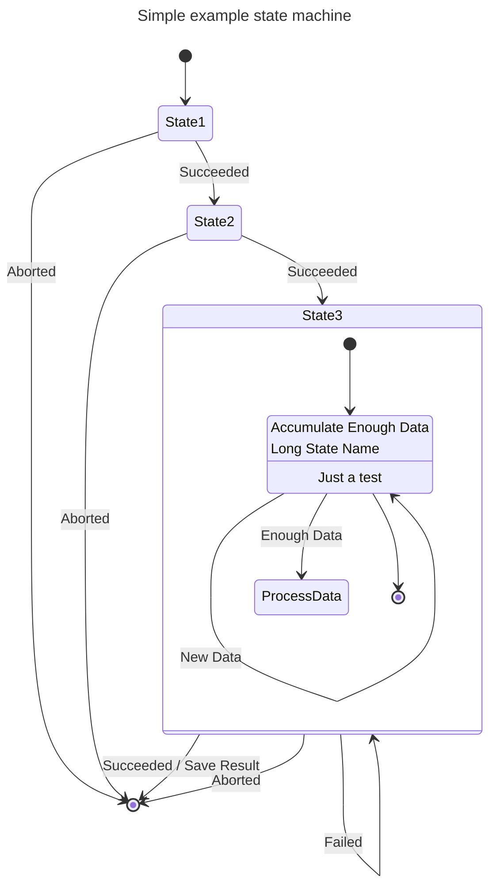

# Zero Cost State Machine

ZCSM is a framework for producing zero cost state machines in rust conveniently.

For example, lets suppose we want to convert the following state machine diagram into code:



A state machine can be generated from this via a procedural macro:

```rust
    use zero_cost_state_machine::statsemachine_from_mermaid;
    statemachine_from_mermaid! {
        r#"
            ---
            title: Simple example state machine
            ---
            stateDiagram-v2
            [*] --> State1
            State1 --> State2 : Succeeded
            State1 --> [*] : Aborted
            State2 --> State3 : Succeeded
            State2 --> [*] : Aborted
            state State3 {
              state "Accumulate Enough Data\nLong State Name" as long1
              long1 : Just a test
              [*] --> long1
              long1 --> long1 : New Data
              long1 --> ProcessData : Enough Data
              long1 --> [*]
            }
            State3 --> State3 : Failed
            State3 --> [*] : Succeeded / Save Result
            State3 --> [*] : Aborted
        "#
    }
```

The above macro code would expand to the following:
```rust
use zero_cost_state_machine::*;
pub mod node {
    pub struct End;

    pub struct Start;

    pub struct State1;

    pub struct State2;

    pub struct State3;
}
pub mod edge {
    pub struct Aborted;

    pub struct Succeeded;
}
pub struct State<S> {
    pub head: S,
}
impl<> Path<()> for State<node::Start> {
    type Target = State<node::State1>;
    fn transition(self, path: ()) -> Self::Target { Self::Target { head: node::State1 } }
}
impl<> Path<edge::Aborted> for State<node::State1> {
    type Target = State<node::End>;
    fn transition(self, path: edge::Aborted) -> Self::Target { Self::Target { head: node::End } }
}
impl<> Path<edge::Succeeded> for State<node::State1> {
    type Target = State<node::State2>;
    fn transition(self, path: edge::Succeeded) -> Self::Target { Self::Target { head: node::State2 } }
}
impl<> Path<edge::Aborted> for State<node::State2> {
    type Target = State<node::End>;
    fn transition(self, path: edge::Aborted) -> Self::Target { Self::Target { head: node::End } }
}
impl<> Path<edge::Succeeded> for State<node::State2> {
    type Target = state3::State<node::State2, edge::Succeeded, state3::node::Start>;
    fn transition(self, path: edge::Succeeded) -> Self::Target { Self::Target { node0: node::State2, edge0: path, head: state3::node::Start } }
}
pub mod state3 {
    use zero_cost_state_machine::*;

    pub mod node {
        pub struct End;

        pub struct Long1;

        pub struct ProcessData;

        pub struct Start;
    }

    pub mod edge {
        pub struct Aborted;

        pub struct EnoughData;

        pub struct Failed;

        pub struct NewData;

        pub struct SucceededSaveResult;
    }

    pub struct State<N0, E0, S> {
        pub node0: N0,
        pub edge0: E0,
        pub head: S,
    }

    impl<N0, E0> Path<()> for State<N0, E0, node::Start> {
        type Target = State<N0, E0, node::Long1>;
        fn transition(self, path: ()) -> Self::Target { Self::Target { node0: self.node0, edge0: self.edge0, head: node::Long1 } }
    }

    impl<N0, E0> Path<()> for State<N0, E0, node::Long1> {
        type Target = State<N0, E0, node::End>;
        fn transition(self, path: ()) -> Self::Target { Self::Target { node0: self.node0, edge0: self.edge0, head: node::End } }
    }

    impl<N0, E0> Path<edge::EnoughData> for State<N0, E0, node::Long1> {
        type Target = State<N0, E0, node::ProcessData>;
        fn transition(self, path: edge::EnoughData) -> Self::Target { Self::Target { node0: self.node0, edge0: self.edge0, head: node::ProcessData } }
    }

    impl<N0, E0> Path<edge::NewData> for State<N0, E0, node::Long1> {
        type Target = State<N0, E0, node::Long1>;
        fn transition(self, path: edge::NewData) -> Self::Target { Self::Target { node0: self.node0, edge0: self.edge0, head: node::Long1 } }
    }

    impl<N0, E0> Path<edge::Aborted> for State<N0, E0, node::End> {
        type Target = super::State<super::node::End>;
        fn transition(self, path: edge::Aborted) -> Self::Target { Self::Target { head: super::node::End } }
    }

    impl<N0, E0> Path<edge::SucceededSaveResult> for State<N0, E0, node::End> {
        type Target = super::State<super::node::End>;
        fn transition(self, path: edge::SucceededSaveResult) -> Self::Target { Self::Target { head: super::node::End } }
    }

    impl<N0, E0> Path<edge::Failed> for State<N0, E0, node::End> {
        type Target = State<N0, E0, node::Start>;
        fn transition(self, path: edge::Failed) -> Self::Target { Self::Target { node0: self.node0, edge0: self.edge0, head: node::Start } }
    }
}
```

# The value propositions of this library are:
1. Provide a way to keep the behavior diagram of an application up to date by generating the state machine of the application from the diagram.
2. Guarantee that the state machine that is generated is zero cost by utilizing only zero sized types.
3. Enforcement at compile time of which transitions can be taken based on what state the application is in.
4. Be the same abstraction regardless of whether in asynchronous contexts and synchronous contexts.
5. Surface as much or as little information in a stack trace as desired.
6. Allow the client to use memory resources as efficiently as possible in a context dependent manner.
7. Give the Client **_ABSOLUTE CONTROL_** over how the stack and heap are used.

#### To integrate this state machine into an application, it can be helpful to know how best to leverage it
Typically, client code will create one impl block per State like the following:
```rust
impl State<node::Start> {
    fn do_something_on_start(self) {
        // do some stuff for the start state (omitted here) ...
        // maybe we have some data we generated as part of this process
        let data = vec![];
        
        // transition to state1, consuming and leaving the current state
        let next_state = self.transition(());
        
        // now we do something for state1, which could require some data
        next_state.do_something_on_state1(&data);
    }
}
impl State<node::State1> {
    fn do_something_on_state1(self, data: &[u8]) {
        // as with node::Start, we could generate more data from this state
        let more_data = String::new();
        
        // at some point we decide on the next edge we will take to transition out of this state
        let edge = edge::Succeeded;
        
        // take the transition
        if edge == edge::Aborted {
            let end = self.transition(edge::Aborted);
            end.do_something_on_end();
        } else {
            let state3 = self.transition(edge::Succeeded);
            state3.do_something_on_state2(data, more_data);
        }
    }
}
impl State<node::State2> {
    fn do_something_on_state2(self, _data: &[u8], _more_data: String) {
        // similar as above
        unimplemented!()
    }
}
impl State<node::State3> {
    fn do_something_on_state3(self) {
        // similar as above
        unimplemented!()
    }
}
impl State<node::End> {
    fn do_something_on_end(self) {
        // similar as above
        unimplemented!()
    }
}
impl State<_, _, state3::node::Start> {
    fn do_something_on_state3_start(self) {
        // similar as above
        unimplemented!()
    }
}
impl State<_, _, state3::node::Long1> {
    fn do_something_on_state3_long1(self) {
        // similar as above
        unimplemented!()
    }
}
impl State<_, _, state3::node::ProcessData> {
    fn do_something_on_state3_process_data(self) {
        // similar as above
        unimplemented!()
    }
}
impl State<_, _, state3::node::End> {
    fn do_something_on_state3_end(self) {
        // similar as above
        unimplemented!()
    }
}
```

### Example design situation

Consider the case where we are oscillating between two states and generating some additional data each time we enter a state.

If the oscillation is bounded to a small number, then we could just call the function to do something on the next state directly as we did in the example code above.
This has the clear advantage of being efficient, require no heap allocation, and gives us a clear immediate understanding of the transition history in any stack trace.

If the oscillation is not bounded, then we cannot continually enter function contexts or else we will blow the stack.
So instead, we could just use a loop and an if statement to switch behavior in each oscillation.
This would not use any additional memory on the stack
If we need to keep a complete (or large) transition history we would store the data on the heap.

If we are oscillating between many states, a useful pattern is to use a "helper" function which calls into the methods defined on the corresponding states.
This helper function does not have to be a method on an actual state, and could just be a free standing function.
For state machines which are generally long running and may transition between its states forever, this would be the typical architecture.

_The key insight is to realize that this library does not force a particular usage of the heap OR the stack._
The only abstractions provided by this library (individual States and Transitions) have **zero size**.
The Client is completely free to use memory however they wish.

# Library Status
Currently this library is a work in progress; the above compiles but I have the following additional objectives before
release:
~~1. migrate from plantUML to mermaid (this should be relatively straightforward since the syntax is mostly compatible)~~
~~2. correctly handle the possibility of exiting a state machine to enter another which is at a much higher depth~~
3. handle parallel join and merge of multiple state machines at the type level
4. docstrings on public facing part of the library
5. more comprehensive testing
6. CI/CD