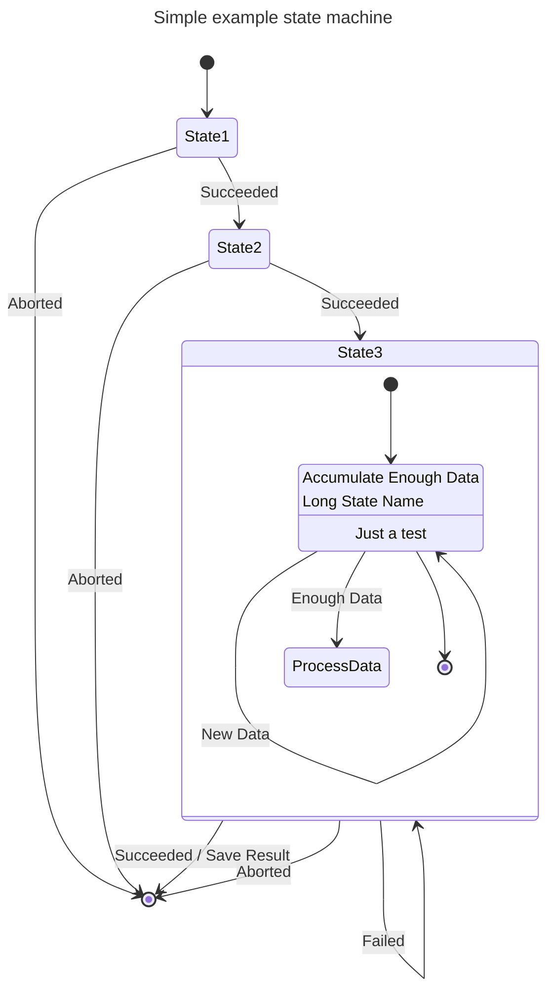

# Zero Cost State Machine

ZCSM is a framework for producing zero cost state machines in rust conveniently.

For example, lets suppose we want to convert the following state machine diagram into code:



A plantUML state machine equivalent to this would be:

```rust
    use zero_cost_state_machine::Switch;
    use zero_cost_state_machine::statemachine_from_puml;
    statemachine_from_puml! {
        r#"@startuml
    
        [*] -> State1
        State1 --> State2 : Succeeded
        State1 --> [*] : Aborted
        State2 --> State3 : Succeeded
        State2 --> [*] : Aborted
        state State3 {
          state "Accumulate Enough Data\nLong State Name" as long1
          long1 : Just a test
          [*] --> long1
          long1 --> long1 : New Data
          long1 --> ProcessData : Enough Data
          long1 --> [*]
        }
        State3 --> State3 : Failed
        State3 --> [*] : Succeeded / Save Result
        State3 --> [*] : Aborted
    
        @enduml"#
    }
```

The above macro code would expand to the following:
```rust
    pub mod node {
        pub struct End;
    
        pub struct Start;
    
        pub struct State1;
    
        pub struct State2;
    
        pub struct State3;
    }
    pub mod edge {
        pub struct Aborted;
    
        pub struct Succeeded;
    }
    pub struct State<S> {
        pub node: S,
    }
    impl<> zero_cost_state_machine::Switch<()> for State<node::Start> {
        type Target = State<node::State1>;
        fn transition(self, path: ()) -> Self::Target { Self::Target { node: node::State1 } }
    }
    impl<> zero_cost_state_machine::Switch<edge::Aborted> for State<node::State1> {
        type Target = State<node::End>;
        fn transition(self, path: edge::Aborted) -> Self::Target { Self::Target { node: node::End } }
    }
    impl<> zero_cost_state_machine::Switch<edge::Succeeded> for State<node::State1> {
        type Target = State<node::State2>;
        fn transition(self, path: edge::Succeeded) -> Self::Target { Self::Target { node: node::State2 } }
    }
    impl<> zero_cost_state_machine::Switch<edge::Aborted> for State<node::State2> {
        type Target = State<node::End>;
        fn transition(self, path: edge::Aborted) -> Self::Target { Self::Target { node: node::End } }
    }
    impl<> zero_cost_state_machine::Switch<edge::Succeeded> for State<node::State2> {
        type Target = state3::State<node::State2, edge::Succeeded, state3::node::Start>;
        fn transition(self, path: edge::Succeeded) -> Self::Target { Self::Target { node0: node::State2, edge0: path, node: state3::node::Start } }
    }
    pub mod state3 {
        pub mod node {
            pub struct End;
    
            pub struct Long1;
    
            pub struct ProcessData;
    
            pub struct Start;
        }
    
        pub mod edge {
            pub struct Aborted;
    
            pub struct EnoughData;
    
            pub struct Failed;
    
            pub struct NewData;
    
            pub struct SucceededSaveResult;
        }
    
        pub struct State<N0, E0, S> {
            pub node0: N0,
            pub edge0: E0,
            pub node: S,
        }
    
        impl<N0, E0> zero_cost_state_machine::Switch<()> for State<N0, E0, node::Start> {
            type Target = State<N0, E0, node::Long1>;
            fn transition(self, path: ()) -> Self::Target { Self::Target { node0: self.node0, edge0: self.edge0, node: node::Long1 } }
        }
    
        impl<N0, E0> zero_cost_state_machine::Switch<()> for State<N0, E0, node::Long1> {
            type Target = State<N0, E0, node::End>;
            fn transition(self, path: ()) -> Self::Target { Self::Target { node0: self.node0, edge0: self.edge0, node: node::End } }
        }
    
        impl<N0, E0> zero_cost_state_machine::Switch<edge::EnoughData> for State<N0, E0, node::Long1> {
            type Target = State<N0, E0, node::ProcessData>;
            fn transition(self, path: edge::EnoughData) -> Self::Target { Self::Target { node0: self.node0, edge0: self.edge0, node: node::ProcessData } }
        }
    
        impl<N0, E0> zero_cost_state_machine::Switch<edge::NewData> for State<N0, E0, node::Long1> {
            type Target = State<N0, E0, node::Long1>;
            fn transition(self, path: edge::NewData) -> Self::Target { Self::Target { node0: self.node0, edge0: self.edge0, node: node::Long1 } }
        }
    
        impl<N0, E0> zero_cost_state_machine::Switch<edge::Aborted> for State<N0, E0, node::End> {
            type Target = super::State<super::node::End>;
            fn transition(self, path: edge::Aborted) -> Self::Target { Self::Target { node: super::node::End } }
        }
    
        impl<N0, E0> zero_cost_state_machine::Switch<edge::SucceededSaveResult> for State<N0, E0, node::End> {
            type Target = super::State<super::node::End>;
            fn transition(self, path: edge::SucceededSaveResult) -> Self::Target { Self::Target { node: super::node::End } }
        }
    
        impl<N0, E0> zero_cost_state_machine::Switch<edge::Failed> for State<N0, E0, node::End> {
            type Target = State<N0, E0, node::Start>;
            fn transition(self, path: edge::Failed) -> Self::Target { Self::Target { node0: self.node0, edge0: self.edge0, node: node::Start } }
        }
    }
```

# Library Status
Currently this library is a work in progress; the above compiles but I have the following additional objectives before
release:
1. migrate from plantUML to mermaid (this should be relatively straightforward since the syntax is mostly compatible)
~~2. correctly handle the possibility of exiting a state machine to enter another which is at a much higher depth~~
3. handle parallel join and merge of multiple state machines at the type level
4. docstrings on public facing part of the library
5. more comprehensive testing
6. CI/CD